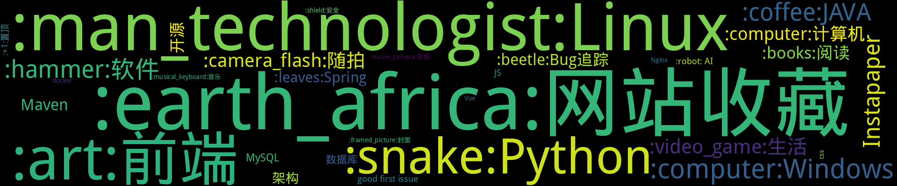

    

    
    
    
    
    
    
    
    

    
    

## :artificial_satellite:今日图片

<b>You can't see me, Meow~~!</b>

    

## 置顶 :thumbsup: 
- [影视节目单](https://github.com/jwenjian/ghiblog/issues/71)  4 :speech_balloon:  	 
- [如果风险投资者问你“如果大公司进入市场与你竞争，怎么办？”，你应该如何回答？](https://github.com/jwenjian/ghiblog/issues/70)  1 :speech_balloon:  	 
- [我喜欢的音乐](https://github.com/jwenjian/ghiblog/issues/67)  0 :speech_balloon:  	 
- [我给GitHub的README做了个访客数量统计功能](https://github.com/jwenjian/ghiblog/issues/43)  1 :speech_balloon:  	 
- [书单](https://github.com/jwenjian/ghiblog/issues/22)  0 :speech_balloon:  	 
- [基于CircleCI自动生成并更新GitHub Issue博客的ReadMe](https://github.com/jwenjian/ghiblog/issues/1)  5 :speech_balloon:  	 
## 最新 :new: 

#### [[From Instapaper] : D盘无法格式化提示Windows无法格式该驱动器怎么办-太平洋IT百科](https://github.com/jwenjian/ghiblog/issues/113) 0 :speech_balloon: 	 2019-09-30 07:59:59

:label: : 

D&#30424;&#26080;&#27861;&#26684;&#24335;&#21270;&#25552;&#31034;Windows&#26080;&#27861;&#26684;&#24335;&#35813;&#39537;&#21160;&#22120;&#24590;&#20040;&#21150;-&#22826;&#24179;&#27915;IT&#30334;&#31185; 
D&#30424;&#26080;&#27861;&#26684;&#24335;&#21270;&#25552;&#31034;Windows&#26080;&#27861;&#26684;&#24335;&#35813;&#39537;&#21160;&#22120;&#24590;&#20040;&#21150;&#65311;&#30005;&#33041;&#23433;&#35013;&#30340;&#26159;Windows10&#30340;&#31995;&#32479;&#65292;&#20170;&#22825;&#24819;&#26684;&#24335;&#21270;D&#30424;&#20877;&#23433;&#35013;&#19968;&#20010;Windows7&#30340;&#31995;&#32479;&#65292;&#20294;&#36827;&#20837;&#36164;&#28304;&#31649;&#29702;&#22120;&#65292;&#26684;&#24335;&#21270;D&#30424;&#26102;&#65292;&#20986;&#29616;&hellip; 
 
 

[更多>>>](https://github.com/jwenjian/ghiblog/issues/113)

---

#### [为何国内师范大学的英文名是XX Normal University](https://github.com/jwenjian/ghiblog/issues/112) 0 :speech_balloon: 	 2019-09-28 13:56:14

:label: : 

如：
- 陕西师范大学 -> Shaanxi Normal University
- 北京师范大学 -> Beijing Normal University

[更多>>>](https://github.com/jwenjian/ghiblog/issues/112)

---

#### [解决windows系统某些软件无法卸载或者安装](https://github.com/jwenjian/ghiblog/issues/111) 0 :speech_balloon: 	 2019-09-26 15:24:10

:label: : [:computer:Windows](https://github.com/jwenjian/ghiblog/labels/%3Acomputer%3AWindows)

Microsoft 出品的修复工具， 专门解决 windows 系统上通过控制面板无法正常卸载或者安装某些软件的问题。

罪犯之一就是 `Autodesk Genuine Service`

[更多>>>](https://github.com/jwenjian/ghiblog/issues/111)

---

#### [消灭 Java 代码的坏味道-InfoQ](https://github.com/jwenjian/ghiblog/issues/109) 0 :speech_balloon: 	 2019-09-20 03:53:58

:label: : [:coffee:JAVA](https://github.com/jwenjian/ghiblog/labels/%3Acoffee%3AJAVA)

消灭 Java 代码的坏味道-InfoQ

- 需要 Map 的主键和取值时，应该迭代 entrySet()
- 应该使用 Collection.isEmpty() 检测空

[更多>>>](https://github.com/jwenjian/ghiblog/issues/109)

---

#### [电子邮件怎样暴露你的信息-InfoQ](https://github.com/jwenjian/ghiblog/issues/108) 0 :speech_balloon: 	 2019-09-18 06:51:23

:label: : [:shield:安全](https://github.com/jwenjian/ghiblog/labels/%3Ashield%3A%E5%AE%89%E5%85%A8)

**电子邮件怎样暴露你的信息-InfoQ**

你的收件箱正在注视着你。是的，我们大多数人都知道我们的线上活动可以被追踪，但是你可能对收到这样的邮件数量感到吃惊，这些邮件可以告诉他们何时何地打开过，以及打开的频率。

[更多>>>](https://github.com/jwenjian/ghiblog/issues/108)

---

## 分类  :card_file_box: 

    

        
        
:cloud: 词云 :cloud: 点击词云展开详细分类:point_down: 

    

:+1:置顶	6:newspaper:

- [影视节目单](https://github.com/jwenjian/ghiblog/issues/71)  4 :speech_balloon:  	 
- [如果风险投资者问你“如果大公司进入市场与你竞争，怎么办？”，你应该如何回答？](https://github.com/jwenjian/ghiblog/issues/70)  1 :speech_balloon:  	 
- [我喜欢的音乐](https://github.com/jwenjian/ghiblog/issues/67)  0 :speech_balloon:  	 
- [我给GitHub的README做了个访客数量统计功能](https://github.com/jwenjian/ghiblog/issues/43)  1 :speech_balloon:  	 
- [书单](https://github.com/jwenjian/ghiblog/issues/22)  0 :speech_balloon:  	 
- [基于CircleCI自动生成并更新GitHub Issue博客的ReadMe](https://github.com/jwenjian/ghiblog/issues/1)  5 :speech_balloon:  	 

:art:前端	13:newspaper:

- [日本邮政官网 - 印章生成器](https://github.com/jwenjian/ghiblog/issues/95)  0 :speech_balloon:  	 
- [HTTP Content-type 对照表](https://github.com/jwenjian/ghiblog/issues/93)  0 :speech_balloon:  	 
- [Permission denied when running npm install](https://github.com/jwenjian/ghiblog/issues/90)  0 :speech_balloon:  	 
- [使用渐变一个div画Chrome浏览器logo](https://github.com/jwenjian/ghiblog/issues/80)  0 :speech_balloon:  	 
- [Brandmark Logo Maker - 基于人工智能的LOGO生成工具](https://github.com/jwenjian/ghiblog/issues/79)  0 :speech_balloon:  	 
- [[From Instapaper] : 臆病な魔女](https://github.com/jwenjian/ghiblog/issues/58)  3 :speech_balloon:  	 
- [[From Instapaper] : 前端必会四步带你吃透浏览器渲染基本原理](https://github.com/jwenjian/ghiblog/issues/55)  0 :speech_balloon:  	 
- [关于浏览器自动填充](https://github.com/jwenjian/ghiblog/issues/42)  0 :speech_balloon:  	 
- [insshot: 自动截屏保存ins用户的最新post](https://github.com/jwenjian/ghiblog/issues/34)  0 :speech_balloon:  	 
- [使用淘宝镜像安装puppeteer](https://github.com/jwenjian/ghiblog/issues/32)  0 :speech_balloon:  	 
- [TKinter教程](https://github.com/jwenjian/ghiblog/issues/25)  0 :speech_balloon:  	 
- [中国色-收集中国传统颜色的网站](https://github.com/jwenjian/ghiblog/issues/20)  0 :speech_balloon:  	 
- [CSS隐藏元素滚动条](https://github.com/jwenjian/ghiblog/issues/15)  0 :speech_balloon:  	 

:beetle:Bug追踪	3:newspaper:

- [Permission denied when running npm install](https://github.com/jwenjian/ghiblog/issues/90)  0 :speech_balloon:  	 
- [Internet troubleshooting: website (www.microsoft.com) is online but isn't responding to connection attempts](https://github.com/jwenjian/ghiblog/issues/66)  0 :speech_balloon:  	 
- [C++: jni.h: no such file or directory ](https://github.com/jwenjian/ghiblog/issues/28)  0 :speech_balloon:  	 

:books:阅读	7:newspaper:

- [An FBI Behaviour Expert Explains How to Quickly Build Trust With Anyone](https://github.com/jwenjian/ghiblog/issues/99)  0 :speech_balloon:  	 
- [微博-刘大可先生：关于“植物身上的黄金分割”的叫你恍然大悟的文章](https://github.com/jwenjian/ghiblog/issues/97)  0 :speech_balloon:  	 
- [如果风险投资者问你“如果大公司进入市场与你竞争，怎么办？”，你应该如何回答？](https://github.com/jwenjian/ghiblog/issues/70)  1 :speech_balloon:  	 
- [[From Instapaper] : 每家门上都挂个西瓜邻居拍照发上网你有素质的样子太美](https://github.com/jwenjian/ghiblog/issues/68)  0 :speech_balloon:  	 
- [[From Instapaper] : 关注英媒中国理所应当鄙视英国](https://github.com/jwenjian/ghiblog/issues/54)  0 :speech_balloon:  	 
- [[From Instapaper] : 中国为什么不搞多党竞争甚至一些党员干部都不知怎么回答](https://github.com/jwenjian/ghiblog/issues/47)  0 :speech_balloon:  	 
- [书单](https://github.com/jwenjian/ghiblog/issues/22)  0 :speech_balloon:  	 

:camera_flash:随拍	6:newspaper:

- [近期生活随拍](https://github.com/jwenjian/ghiblog/issues/89)  0 :speech_balloon:  	 
- [青岛之行随拍](https://github.com/jwenjian/ghiblog/issues/44)  2 :speech_balloon:  	 
- [端午节随拍](https://github.com/jwenjian/ghiblog/issues/31)  0 :speech_balloon:  	 
- [2019年的第一次旅行](https://github.com/jwenjian/ghiblog/issues/17)  0 :speech_balloon:  	 
- [本周生活随拍](https://github.com/jwenjian/ghiblog/issues/10)  0 :speech_balloon:  	 
- [借光计划-798艺术区](https://github.com/jwenjian/ghiblog/issues/8)  0 :speech_balloon:  	 

:coffee:JAVA	9:newspaper:

- [消灭 Java 代码的坏味道-InfoQ](https://github.com/jwenjian/ghiblog/issues/109)  0 :speech_balloon:  	 
- [springboot + mybatis 打印SQL日志到控制台](https://github.com/jwenjian/ghiblog/issues/105)  0 :speech_balloon:  	 
- [负载均衡](https://github.com/jwenjian/ghiblog/issues/104)  0 :speech_balloon:  	 
- [如何在优雅地Spring 中实现消息的发送和消费](https://github.com/jwenjian/ghiblog/issues/85)  0 :speech_balloon:  	 
- [如何优雅关闭 Spring Boot 应用](https://github.com/jwenjian/ghiblog/issues/72)  0 :speech_balloon:  	 
- [start.spring.io支持在线预览生成的文件内容](https://github.com/jwenjian/ghiblog/issues/63)  1 :speech_balloon:  	 
- [[From Instapaper] : Java.lang.Void 与 void 的比较及使用](https://github.com/jwenjian/ghiblog/issues/60)  0 :speech_balloon:  	 
- [How to prevent XXE injection when convert xml to object in java](https://github.com/jwenjian/ghiblog/issues/37)  0 :speech_balloon:  	 
- [配置SpringBoot定时任务线程池](https://github.com/jwenjian/ghiblog/issues/21)  0 :speech_balloon:  	 

:computer:Windows	13:newspaper:

- [解决windows系统某些软件无法卸载或者安装](https://github.com/jwenjian/ghiblog/issues/111)  0 :speech_balloon:  	 
- [[From Instapaper] : CPUID](https://github.com/jwenjian/ghiblog/issues/74)  0 :speech_balloon:  	 
- [如何在 Chromium 版 Edge 浏览器上安装 Google Chrome 应用商店的扩展](https://github.com/jwenjian/ghiblog/issues/73)  0 :speech_balloon:  	 
- [Internet troubleshooting: website (www.microsoft.com) is online but isn't responding to connection attempts](https://github.com/jwenjian/ghiblog/issues/66)  0 :speech_balloon:  	 
- [[From Instapaper] : Task Scheduler - Windows applications | Windows上的定时任务管理器](https://github.com/jwenjian/ghiblog/issues/57)  1 :speech_balloon:  	 
- [pydice: Python的GUI应用 - 课堂点名工具](https://github.com/jwenjian/ghiblog/issues/36)  1 :speech_balloon:  	 
- [PAGE - Python Automatic GUI Generator](https://github.com/jwenjian/ghiblog/issues/35)  0 :speech_balloon:  	 
- [调整Typora显示宽度](https://github.com/jwenjian/ghiblog/issues/18)  0 :speech_balloon:  	 
- [Windows截图工具-Snipaste](https://github.com/jwenjian/ghiblog/issues/13)  0 :speech_balloon:  	 
- [Windows工具-制作启动U盘](https://github.com/jwenjian/ghiblog/issues/11)  0 :speech_balloon:  	 
- [智能屏幕护眼软件: f.lux](https://github.com/jwenjian/ghiblog/issues/5)  0 :speech_balloon:  	 
- [windows系统-gif 动画录制软件](https://github.com/jwenjian/ghiblog/issues/4)  0 :speech_balloon:  	 
- [谷歌浏览器原生支持触控板快速前进后退](https://github.com/jwenjian/ghiblog/issues/3)  0 :speech_balloon:  	 

:computer:计算机	9:newspaper:

- [使用Alt-svc自举  HTTP/3 explained](https://github.com/jwenjian/ghiblog/issues/98)  0 :speech_balloon:  	 
- [[From Instapaper] : Distinguished Names](https://github.com/jwenjian/ghiblog/issues/51)  0 :speech_balloon:  	 
- [[From Instapaper] : Http response header - Age](https://github.com/jwenjian/ghiblog/issues/50)  0 :speech_balloon:  	 
- [关于浏览器自动填充](https://github.com/jwenjian/ghiblog/issues/42)  0 :speech_balloon:  	 
- [C++: Ignore warnings C4996](https://github.com/jwenjian/ghiblog/issues/30)  0 :speech_balloon:  	 
- [C++: 引用和指针](https://github.com/jwenjian/ghiblog/issues/29)  0 :speech_balloon:  	 
- [C++: jni.h: no such file or directory ](https://github.com/jwenjian/ghiblog/issues/28)  0 :speech_balloon:  	 
- [C语言-位运算符](https://github.com/jwenjian/ghiblog/issues/27)  0 :speech_balloon:  	 
- [HSTS](https://github.com/jwenjian/ghiblog/issues/14)  0 :speech_balloon:  	 

:earth_africa:网站收藏	15:newspaper:

- [AirPano.com: 360° 全景图片 + 视频展示世界各地美景](https://github.com/jwenjian/ghiblog/issues/106)  0 :speech_balloon:  	 
- [Mixkit 发布免费可商用的艺术画与插图平台 - 小众软件](https://github.com/jwenjian/ghiblog/issues/101)  0 :speech_balloon:  	 
- [ColouriseSG: 利用AI给黑白照片上色](https://github.com/jwenjian/ghiblog/issues/96)  0 :speech_balloon:  	 
- [日本邮政官网 - 印章生成器](https://github.com/jwenjian/ghiblog/issues/95)  0 :speech_balloon:  	 
- [PowerPoint Countdown Timer](https://github.com/jwenjian/ghiblog/issues/94)  0 :speech_balloon:  	 
- [HTTP Content-type 对照表](https://github.com/jwenjian/ghiblog/issues/93)  0 :speech_balloon:  	 
- [remove.bg - Remove Background from Image  ](https://github.com/jwenjian/ghiblog/issues/92)  0 :speech_balloon:  	 
- [Brandmark Logo Maker - 基于人工智能的LOGO生成工具](https://github.com/jwenjian/ghiblog/issues/79)  0 :speech_balloon:  	 
- [Codeimg.io 代码 -> 图片 -> 分享](https://github.com/jwenjian/ghiblog/issues/78)  0 :speech_balloon:  	 
- [[From Instapaper] : 臆病な魔女](https://github.com/jwenjian/ghiblog/issues/58)  3 :speech_balloon:  	 
- [[From Instapaper] : 西尾維新オフィシャルサイト](https://github.com/jwenjian/ghiblog/issues/53)  1 :speech_balloon:  	 
- [HTTP CAT: 用猫的图片来形象的表示每一个http状态码](https://github.com/jwenjian/ghiblog/issues/45)  0 :speech_balloon:  	 
- [中国色-收集中国传统颜色的网站](https://github.com/jwenjian/ghiblog/issues/20)  0 :speech_balloon:  	 
- [Linux命令在线查询手册](https://github.com/jwenjian/ghiblog/issues/12)  0 :speech_balloon:  	 
- [Windows工具-制作启动U盘](https://github.com/jwenjian/ghiblog/issues/11)  0 :speech_balloon:  	 

:hammer:软件	11:newspaper:

- [PowerPoint Countdown Timer](https://github.com/jwenjian/ghiblog/issues/94)  0 :speech_balloon:  	 
- [[From Instapaper] : CPUID](https://github.com/jwenjian/ghiblog/issues/74)  0 :speech_balloon:  	 
- [如何在 Chromium 版 Edge 浏览器上安装 Google Chrome 应用商店的扩展](https://github.com/jwenjian/ghiblog/issues/73)  0 :speech_balloon:  	 
- [C++: Ignore warnings C4996](https://github.com/jwenjian/ghiblog/issues/30)  0 :speech_balloon:  	 
- [Eclipse.ini使用-vm参数指定JVM](https://github.com/jwenjian/ghiblog/issues/26)  0 :speech_balloon:  	 
- [Eclipse网络代理配置](https://github.com/jwenjian/ghiblog/issues/19)  0 :speech_balloon:  	 
- [调整Typora显示宽度](https://github.com/jwenjian/ghiblog/issues/18)  0 :speech_balloon:  	 
- [Windows截图工具-Snipaste](https://github.com/jwenjian/ghiblog/issues/13)  0 :speech_balloon:  	 
- [Windows工具-制作启动U盘](https://github.com/jwenjian/ghiblog/issues/11)  0 :speech_balloon:  	 
- [智能屏幕护眼软件: f.lux](https://github.com/jwenjian/ghiblog/issues/5)  0 :speech_balloon:  	 
- [windows系统-gif 动画录制软件](https://github.com/jwenjian/ghiblog/issues/4)  0 :speech_balloon:  	 

:leaves:Spring	6:newspaper:

- [springboot + mybatis 打印SQL日志到控制台](https://github.com/jwenjian/ghiblog/issues/105)  0 :speech_balloon:  	 
- [如何在优雅地Spring 中实现消息的发送和消费](https://github.com/jwenjian/ghiblog/issues/85)  0 :speech_balloon:  	 
- [如何优雅关闭 Spring Boot 应用](https://github.com/jwenjian/ghiblog/issues/72)  0 :speech_balloon:  	 
- [start.spring.io支持在线预览生成的文件内容](https://github.com/jwenjian/ghiblog/issues/63)  1 :speech_balloon:  	 
- [How to add custom properties to manifest file with spring boot](https://github.com/jwenjian/ghiblog/issues/24)  0 :speech_balloon:  	 
- [配置SpringBoot定时任务线程池](https://github.com/jwenjian/ghiblog/issues/21)  0 :speech_balloon:  	 

:man_technologist:Linux	8:newspaper:

- [Docker配置HTTP/HTTPS代理](https://github.com/jwenjian/ghiblog/issues/88)  0 :speech_balloon:  	 
- [vbox ubuntu虚拟机扩容方案 虚拟分配空间转换为实际分配空间](https://github.com/jwenjian/ghiblog/issues/87)  0 :speech_balloon:  	 
- [在Ubuntu上安装nodejs、npm](https://github.com/jwenjian/ghiblog/issues/65)  1 :speech_balloon:  	 
- [为Ubuntu系统包管理工具apt配置代理](https://github.com/jwenjian/ghiblog/issues/61)  0 :speech_balloon:  	 
- [调整Typora显示宽度](https://github.com/jwenjian/ghiblog/issues/18)  0 :speech_balloon:  	 
- [Linux命令在线查询手册](https://github.com/jwenjian/ghiblog/issues/12)  0 :speech_balloon:  	 
- [Linux-编译安装nginx源码](https://github.com/jwenjian/ghiblog/issues/9)  0 :speech_balloon:  	 
- [Nginx代理Oracle数据库连接](https://github.com/jwenjian/ghiblog/issues/6)  0 :speech_balloon:  	 

:movie_camera:视频	1:newspaper:

- [我们的生活多愉快~](https://github.com/jwenjian/ghiblog/issues/7)  0 :speech_balloon:  	 

:musical_keyboard:音乐	1:newspaper:

- [我喜欢的音乐](https://github.com/jwenjian/ghiblog/issues/67)  0 :speech_balloon:  	 

:robot: AI	2:newspaper:

- [ColouriseSG: 利用AI给黑白照片上色](https://github.com/jwenjian/ghiblog/issues/96)  0 :speech_balloon:  	 
- [remove.bg - Remove Background from Image  ](https://github.com/jwenjian/ghiblog/issues/92)  0 :speech_balloon:  	 

:shield:安全	1:newspaper:

- [电子邮件怎样暴露你的信息-InfoQ](https://github.com/jwenjian/ghiblog/issues/108)  0 :speech_balloon:  	 

:snake:Python	12:newspaper:

- [Predictably Random](https://github.com/jwenjian/ghiblog/issues/103)  0 :speech_balloon:  	 
- [Python_uuid 学习总结](https://github.com/jwenjian/ghiblog/issues/91)  0 :speech_balloon:  	 
- [[From Instapaper] : How to use Python virtualenv](https://github.com/jwenjian/ghiblog/issues/64)  1 :speech_balloon:  	 
- [[From Instapaper] : The Flask Mega-Tutorial Part I: Hello World! - miguelgrinberg.com](https://github.com/jwenjian/ghiblog/issues/62)  2 :speech_balloon:  	 
- [我给GitHub的README做了个访客数量统计功能](https://github.com/jwenjian/ghiblog/issues/43)  1 :speech_balloon:  	 
- [Python: 对数组进行选择排序](https://github.com/jwenjian/ghiblog/issues/41)  0 :speech_balloon:  	 
- [Python: 对数组进行插入排序](https://github.com/jwenjian/ghiblog/issues/40)  0 :speech_balloon:  	 
- [Python操作剪贴板](https://github.com/jwenjian/ghiblog/issues/38)  0 :speech_balloon:  	 
- [pydice: Python的GUI应用 - 课堂点名工具](https://github.com/jwenjian/ghiblog/issues/36)  1 :speech_balloon:  	 
- [PAGE - Python Automatic GUI Generator](https://github.com/jwenjian/ghiblog/issues/35)  0 :speech_balloon:  	 
- [TKinter教程](https://github.com/jwenjian/ghiblog/issues/25)  0 :speech_balloon:  	 
- [转载-浅谈 Python 的 with 语句](https://github.com/jwenjian/ghiblog/issues/23)  0 :speech_balloon:  	 

:video_game:生活	10:newspaper:

- [近期生活随拍](https://github.com/jwenjian/ghiblog/issues/89)  0 :speech_balloon:  	 
- [舒尔特训练法](https://github.com/jwenjian/ghiblog/issues/75)  0 :speech_balloon:  	 
- [影视节目单](https://github.com/jwenjian/ghiblog/issues/71)  4 :speech_balloon:  	 
- [高铁/动车上插座都在什么位置](https://github.com/jwenjian/ghiblog/issues/59)  2 :speech_balloon:  	 
- [书单](https://github.com/jwenjian/ghiblog/issues/22)  0 :speech_balloon:  	 
- [2019年的第一次旅行](https://github.com/jwenjian/ghiblog/issues/17)  0 :speech_balloon:  	 
- [bye 2018](https://github.com/jwenjian/ghiblog/issues/16)  3 :speech_balloon:  	 
- [本周生活随拍](https://github.com/jwenjian/ghiblog/issues/10)  0 :speech_balloon:  	 
- [借光计划-798艺术区](https://github.com/jwenjian/ghiblog/issues/8)  0 :speech_balloon:  	 
- [我们的生活多愉快~](https://github.com/jwenjian/ghiblog/issues/7)  0 :speech_balloon:  	 

Instapaper	11:newspaper:

- [LinkedIn如何在一台机器上支持几十万条长连接？](https://github.com/jwenjian/ghiblog/issues/77)  0 :speech_balloon:  	 
- [[From Instapaper] : C/C 静态链接库(.a) 与 动态链接库(.so) - 52php - 博客园](https://github.com/jwenjian/ghiblog/issues/76)  0 :speech_balloon:  	 
- [[From Instapaper] : Task Scheduler - Windows applications | Windows上的定时任务管理器](https://github.com/jwenjian/ghiblog/issues/57)  1 :speech_balloon:  	 
- [[From Instapaper] : Should Neil Armstrongs Bootprints Be on the Moon Forever](https://github.com/jwenjian/ghiblog/issues/56)  1 :speech_balloon:  	 
- [[From Instapaper] : 前端必会四步带你吃透浏览器渲染基本原理](https://github.com/jwenjian/ghiblog/issues/55)  0 :speech_balloon:  	 
- [[From Instapaper] : 关注英媒中国理所应当鄙视英国](https://github.com/jwenjian/ghiblog/issues/54)  0 :speech_balloon:  	 
- [[From Instapaper] : 西尾維新オフィシャルサイト](https://github.com/jwenjian/ghiblog/issues/53)  1 :speech_balloon:  	 
- [[From Instapaper] : Distinguished Names](https://github.com/jwenjian/ghiblog/issues/51)  0 :speech_balloon:  	 
- [[From Instapaper] : Http response header - Age](https://github.com/jwenjian/ghiblog/issues/50)  0 :speech_balloon:  	 
- [[From Instapaper] : maven getting "Not Authorized" when trying to access nexus private repository](https://github.com/jwenjian/ghiblog/issues/48)  0 :speech_balloon:  	 
- [[From Instapaper] : 中国为什么不搞多党竞争甚至一些党员干部都不知怎么回答](https://github.com/jwenjian/ghiblog/issues/47)  0 :speech_balloon:  	 

JS	2:newspaper:

- [Permission denied when running npm install](https://github.com/jwenjian/ghiblog/issues/90)  0 :speech_balloon:  	 
- [[From Instapaper] : 西尾維新オフィシャルサイト](https://github.com/jwenjian/ghiblog/issues/53)  1 :speech_balloon:  	 

Maven	5:newspaper:

- [Install parent POM without building Child modules](https://github.com/jwenjian/ghiblog/issues/82)  0 :speech_balloon:  	 
- [[From Instapaper] : maven getting "Not Authorized" when trying to access nexus private repository](https://github.com/jwenjian/ghiblog/issues/48)  0 :speech_balloon:  	 
- [Maven: maven-dependency-plugin:get 通过命令行下载jar包到本地仓库 无需pom文件](https://github.com/jwenjian/ghiblog/issues/39)  0 :speech_balloon:  	 
- [Maven: mvn clean install --fail-at-end](https://github.com/jwenjian/ghiblog/issues/33)  0 :speech_balloon:  	 
- [How to add custom properties to manifest file with spring boot](https://github.com/jwenjian/ghiblog/issues/24)  0 :speech_balloon:  	 

Nginx	1:newspaper:

- [Linux-编译安装nginx源码](https://github.com/jwenjian/ghiblog/issues/9)  0 :speech_balloon:  	 

good first issue	2:newspaper:

- [如果风险投资者问你“如果大公司进入市场与你竞争，怎么办？”，你应该如何回答？](https://github.com/jwenjian/ghiblog/issues/70)  1 :speech_balloon:  	 
- [基于CircleCI自动生成并更新GitHub Issue博客的ReadMe](https://github.com/jwenjian/ghiblog/issues/1)  5 :speech_balloon:  	 

开源	2:newspaper:

- [比拼 Kafka 大数据分析新秀Pulsar到底好在哪-InfoQ](https://github.com/jwenjian/ghiblog/issues/100)  0 :speech_balloon:  	 
- [一款与 Python 深度集成的 Excel IDE](https://github.com/jwenjian/ghiblog/issues/84)  0 :speech_balloon:  	 

架构	5:newspaper:

- [负载均衡](https://github.com/jwenjian/ghiblog/issues/104)  0 :speech_balloon:  	 
- [比拼 Kafka 大数据分析新秀Pulsar到底好在哪-InfoQ](https://github.com/jwenjian/ghiblog/issues/100)  0 :speech_balloon:  	 
- [RocketMQ与kafka对比18项差异](https://github.com/jwenjian/ghiblog/issues/83)  0 :speech_balloon:  	 
- [白话中台战略 - InfoQ](https://github.com/jwenjian/ghiblog/issues/81)  0 :speech_balloon:  	 
- [LinkedIn如何在一台机器上支持几十万条长连接？](https://github.com/jwenjian/ghiblog/issues/77)  0 :speech_balloon:  	 

    

## 关于:boy: 

**Jiang Wenjian**

:round_pushpin: Beijing, China

:black_flag: A good code is like a story, not a puzzle.
